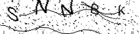
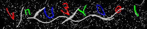
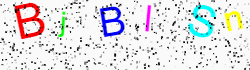

# React CAPTCHA Component

A customizable CAPTCHA component for React, allowing various styles and configurations to protect forms from bots.

## Features

- Customizable dimensions and font sizes
- Background and text colors
- Noise and lines for added security
- Distortion effects
- Individual character styles
- Regeneration on demand

## Installation

To install the package via npm:

```bash
npm install react-captcha-generator
```

Or with yarn:

```bash
yarn add react-captcha-generator
```

## Usage

Here’s a basic example of how to use the `Captcha` component:

```jsx
import React, { useState } from "react";
import Captcha from "react-captcha-generator";

const App = () => {
  const [captcha, setCaptcha] = useState("");

  return (
    <div>
      <Captcha
        width={250}
        height={70}
        length={6}
        fontSize={36}
        bgColor="#f0f0f0"
        textColor="#333"
        noise={true}
        noiseColor="#999"
        noiseDensity={0.1}
        lines={true}
        lineColor="#666"
        lineWidth={2}
        distortion={true}
        distortionAmount={6}
        onChange={(value) => setCaptcha(value)}
        regenerate={false}
      />
      <p>Captcha Value: {captcha}</p>
    </div>
  );
};

export default App;
```

## Props

| Prop               | Type                                                   | Default     | Description                                                                                       |
| ------------------ | ------------------------------------------------------ | ----------- | ------------------------------------------------------------------------------------------------- |
| `width`            | `number`                                               | `200`       | Width of the CAPTCHA canvas.                                                                      |
| `height`           | `number`                                               | `50`        | Height of the CAPTCHA canvas.                                                                     |
| `length`           | `number`                                               | `6`         | Number of characters in the CAPTCHA text.                                                         |
| `fontSize`         | `number`                                               | `30`        | Font size of the CAPTCHA text.                                                                    |
| `bgColor`          | `string`                                               | `#ffffff`   | Background color of the CAPTCHA canvas.                                                           |
| `textColor`        | `string \| string[]`                                   | `#000000`   | Color of the CAPTCHA text; can be a single color or an array of colors for individual characters. |
| `noise`            | `boolean`                                              | `true`      | Whether to add noise to the CAPTCHA.                                                              |
| `noiseColor`       | `string`                                               | `#000000`   | Color of the noise.                                                                               |
| `noiseDensity`     | `number`                                               | `0.05`      | Density of the noise; control how much noise is added.                                            |
| `lines`            | `boolean`                                              | `true`      | Whether to add random lines to the CAPTCHA.                                                       |
| `lineColor`        | `string`                                               | `#000000`   | Color of the lines.                                                                               |
| `lineWidth`        | `number`                                               | `1`         | Width of the lines.                                                                               |
| `distortion`       | `boolean`                                              | `true`      | Whether to apply distortion effects to the CAPTCHA.                                               |
| `distortionAmount` | `number`                                               | `4`         | Amount of distortion applied.                                                                     |
| `onChange`         | `(captcha: string) => void`                            | `undefined` | Callback function that is called when the CAPTCHA value changes.                                  |
| `regenerate`       | `boolean`                                              | `false`     | triggers CAPTCHA regeneration by changing false and true.                                                         |
| `charStyles`       | `{ [key: number]: { size?: number; color?: string } }` | `{}`        | Individual styles for each character, including size and color.                                   |

## Examples

### Example 1: Basic Usage



```jsx
<Captcha
  width={200}
  height={50}
  length={5}
  fontSize={24}
  bgColor="#fff"
  textColor="#000"
  noise={true}
  lines={true}
  distortion={true}
/>
```

### Example 2: Custom Colors and Noise



```jsx
<Captcha
  width={300}
  height={60}
  length={8}
  fontSize={28}
  bgColor="#000000"
  textColor={["#ff0000", "#00ff00", "#0000ff"]}
  noiseColor="#aaaaaa"
  noiseDensity={0.1}
  lines={true}
  lineColor="#cccccc"
  lineWidth={2}
  distortion={true}
  distortionAmount={6}
/>
```

### Example 3: Individual Character Styles



```jsx
<Captcha
  width={250}
  height={70}
  length={6}
  fontSize={36}
  bgColor="#fafafa"
  textColor="#000"
  noise={true}
  lines={false}
  distortion={false}
  charStyles={{
    0: { size: 40, color: "#ff0000" },
    1: { size: 30, color: "#00ff00" },
    2: { size: 35, color: "#0000ff" },
    3: { size: 32, color: "#ff00ff" },
    4: { size: 38, color: "#00ffff" },
    5: { size: 30, color: "#ffff00" },
  }}
/>
```

## License

This project is licensed under the MIT License - see the [LICENSE](LICENSE) file for details.

## Author

[Navid Mousavizadeh](https://github.com/Navid-Mousavizdeh)

```

```
